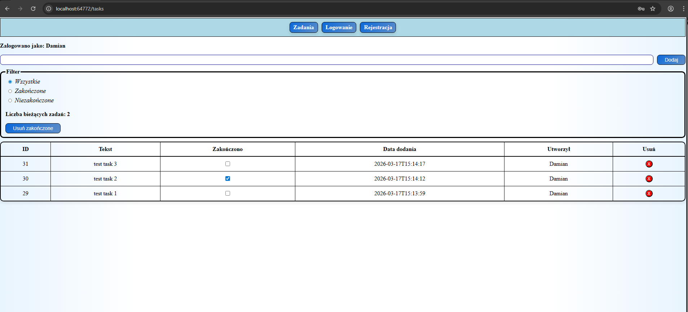

# TaskManager
A full-stack task management application built with ASP.NET Core and React, featuring JWT authentication, middleware-based logging, and secure password handling.

## Demo

## Features
### API
- Request logging through middleware,
- Error handling through middleware,
- Handling JWT authorization,
- Password hashing and verification,
- Database handling through controllers.

### React
- Clean UI,
- CSS,
- Keeping user info and connection token in session,
- Communication with API.

## Tech stack
# Frameworks:
- ASP.NET Core,
- .NET 8.0,
- React,
- MySql.

# Languages
- C#,
- JavaScript,
- CSS.

## Installation
In the main project folder you will find a Setup folder which contains all files necessary to set up the app.

1. Open MySql Workbench,
2. In the Setup folder there is an image of the database, import it through the Workbench,
3. Open Visual Studio,
4. Clone the project,
5. In the setup folder there is an "appsettings.json" file, modify the DefaultConnection (put your connection string in there) and Key (make up an JWT API key and put it in here),
6. If everything was done right and the database is running, go ahead and run the application in the default configuration.

## Usage
1. Register an user using the register form,
2. Log in into the task manager with the newly created user,
3. Add, update and delete tasks across your database.

## Contributing

Pull requests are welcome. Open an issue first.

## License

MIT
